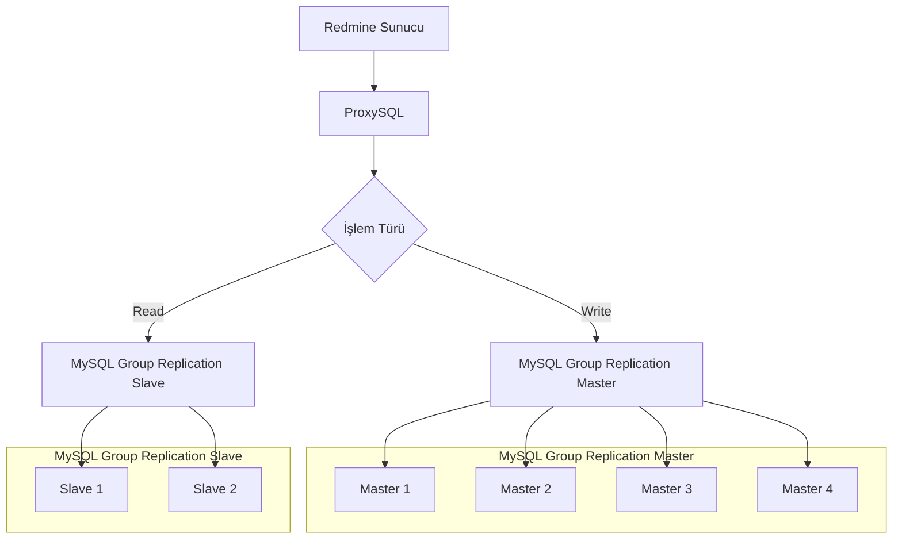
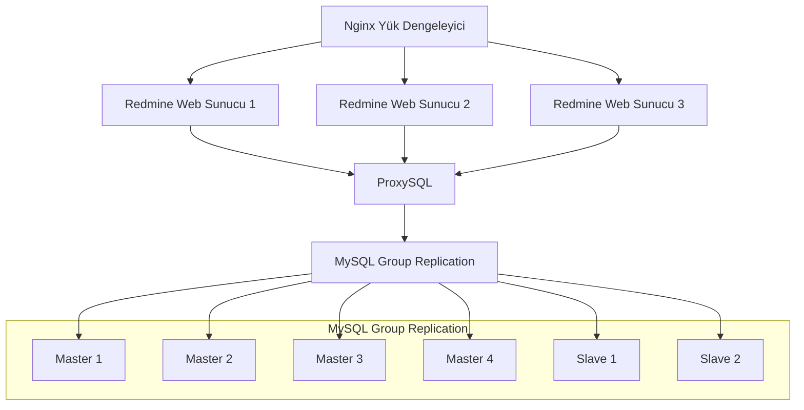
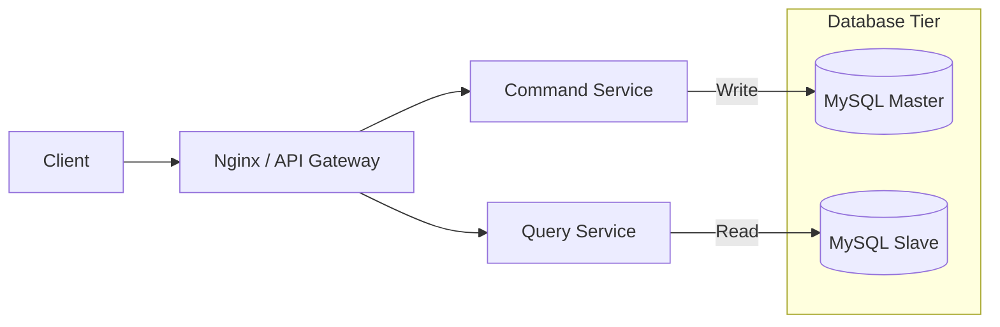

# Redmine Sunucu ve MySQL Group Replication

# Nginx Yük Dengeleyici ve Redmine Web Cluster

# Nginx Yük Dengeleyici ve CQRS Deseni

CQRS mimarisinde bir yazılımın kümeli veritabanı yapısıyla çalışması:

