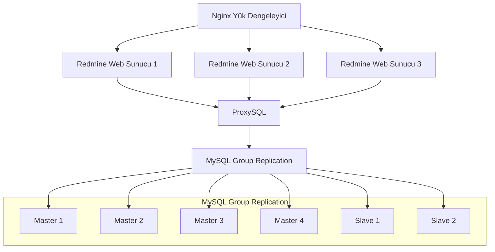

# Redmine Sunucu ve MySQL Group Replication

```mermaid
graph TD
  A[Redmine Sunucu] --> B[ProxySQL]
  B --> C{İşlem Türü}
  C -->|Write| D[MySQL Group Replication (Master)]
  C -->|Read| E[MySQL Group Replication (Slave)]
  subgraph MySQL Group Replication (Master)
    F[Master 1]
    G[Master 2]
    H[Master 3]
    I[Master 4]
  end
  subgraph MySQL Group Replication (Slave)
    J[Slave 1]
    K[Slave 2]
  end
  D --> F
  D --> G
  D --> H
  D --> I
  E --> J
  E --> K
```

# Nginx Yük Dengeleyici ve Redmine Web Cluster



# Nginx Yük Dengeleyici ve CQRS Deseni

```mermaid
graph TD
  A[Nginx Yük Dengeleyici] --> B[Web Sunucu (Command)]
  A --> C[Web Sunucu (Query)]
  B --> D[ProxySQL]
  C --> D
  D --> E[MySQL Group Replication]
  subgraph MySQL Group Replication
    F[Master 1]
    G[Master 2]
    H[Master 3]
    I[Master 4]
    J[Slave 1]
    K[Slave 2]
  end
  E --> F
  E --> G
  E --> H
  E --> I
  E --> J
  E --> K
```